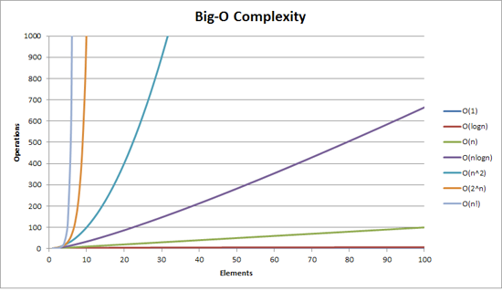

# 시간복잡도

* [빅오 표기법](#빅오-표기법)

### 빅오 표기법

> 시간 복잡도란
> 
> 문제를 해결하는 데 걸리는 시간과 입력의 함수 관계

* 어떠한 알고리즘의 로직이 '얼마나 오랜 시간'이 걸리는지를 나태내는 데 쓰임
* 빅오 표기법을 주로 사용
  * 입력 범위 n을 기준으로 해서 로직이 몇 번 반복되는지 나타내는 것

#### 프로그램 예시

```java
import java.util.Scanner;

public class Main {
    public static void main(String[] args) {
        Scanner sc = new Scanner(System.in);
        int n = sc.nextInt();
        for (int i = 0; i < 10; i++) {
            for (int j = 0; j < n; j++) {
                for (int k = 0; k < n; k++) {
                    if(true) System.out.println(k);
                }
            }
        }

        for (int i = 0; i < n; i++) {
            if(true) System.out.println(i);
        }
    }
}
```

* 해당 예시의 시간복잡도는 `O(n^2)`
* 가정 영향을 많이 끼치는 항의 상수 인자를 빼고 나머지 항을 없앤 값

### 시간 복잡도의 존재 이유



* 로직의 효율성을 개선하는 척도가 된다.
