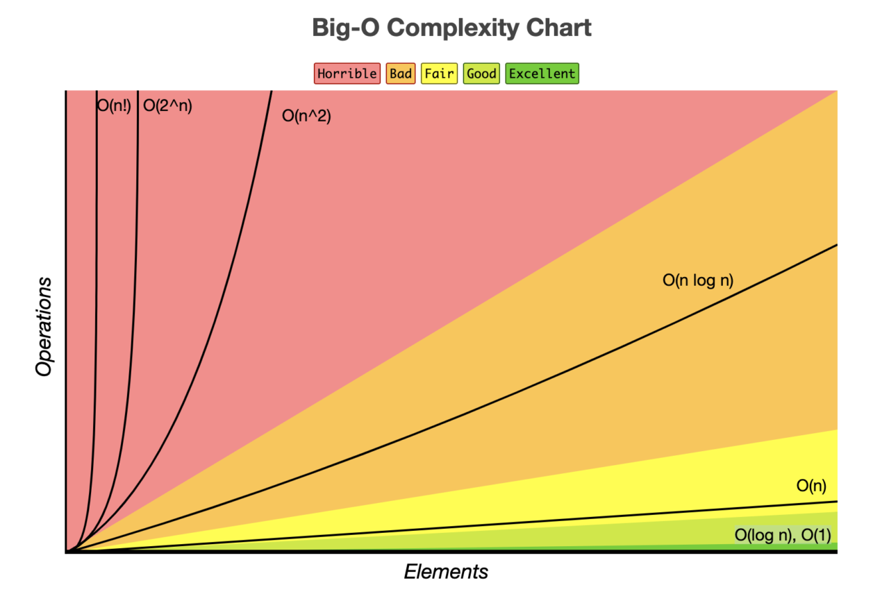

- **시간 복잡도**

  → 입력 값의 변화에 따라 연산을 실행할 때, 연산 횟수에 비해 시간이 얼마만큼 걸리는가?

  → 빅-오 표기법 사용


- **효과적인 알고리즘**

  → 입력 값이 커짐에 따라 증가하는 시간의 비율이 최소화 된 알고리즘


- **Big - O 표기법 종류**
    - **Big - O** ⇒ 상한 접근
    - Big - Ω ⇒ 하한 접근
    - Big - θ ⇒ 둘 다 접근 (평균)


- **Big-O 표기법이 가장 많이 사용**

  why? 프로그램이 실행되는 과정에서 최악(시간이 가장 오래 걸릴 경우)을 생각해야 그에 맞는 대응이 가능하기 때문에.


- **Big - O 표기법**
    - **O(1)** : **일정한 복잡도(constant complexity).**
    
       입력 값이 늘어나도 시간은 그대로.

    - **O(N)** : **선형 복잡도(linear complexity).**

        시간은 입력 값 증가 비율과 같은 비율로 증가.
  
        2n의 비율로 늘어나도 n으로 표기(상수 생략).

    - **O(log n)** : **로그 복잡도(logarithmic complexity).**

         O(1) 다음으로 빠른 시간 복잡도를 가짐.
  
         대표적인 알고리즘 : **이진 탐색**(Binary Search Tree).

    - **O(n^2)** :  **2차 복잡도(quadratic complexity).**

         입력 값 증가에 따라 시간이 n의 제곱수 비율로 증가.
        
         n이 커지면 커질 수록 지수가 주는 영향력이 점점 퇴색 됨.

    - **O(2^n)** : **기하급수적 복잡도(exponential complexity).**

         입력 값에 따라 매번 시간이 2배로 증가. 

         다른 알고리즘을 생각해 보는게 좋음.

         대표적인 알고리즘 : **피보나치 수열**.




- **Big-O 자세한 예시**
    - **O(1)**

    ```java
    public class baekjoon {
        public static void main(String[] args) {
    				int[] arr = {1, 2, 3, 4, 5};
            int index = 1;
            
            System.out.println(arr[index]);
        }
    }
    ```

    - **O(N)**

    ```java
    public class Main {
        public static void main(String[] args)  {
            int[] arr = {1, 2, 3, 4, 5};
    
            for(int i = 0; i < arr.length; i++){
                System.out.println(arr[i]);
            }
        }
    }
    ```

    - **O(log n)**

    ```java
    public class Main {
        static int[] arr = {1, 2, 3, 4, 5};
    
        public static void main(String[] args)  {
            //5의 인덱스를 찾고 싶다.
            System.out.println(binarySearch(5, 0, arr.length-1));
        }
    
        static int binarySearch(int key, int low, int high) {
            int mid = (low + high)/2;
            if(low <= high) {
                if (key == arr[mid])
                    return mid;
                else if (key > arr[mid])
                    return binarySearch(key, mid + 1, high);
                else
                    return binarySearch(key, low, mid - 1);
            }
            return -1;
        }
    }
    ```

    - **O(n^2)**

    ```java
    public class Main {
        public static void main(String[] args)  {
            int n = 5;
    
            for(int i = 0; i < n; i++) {
                for(int u = 0; u < n; u++) {
                    for(int y = 0; y < n; y++) {
                        //do something for 1 second
                    }
                }
            }
        }
    }
    ```

    - **O(2n)**