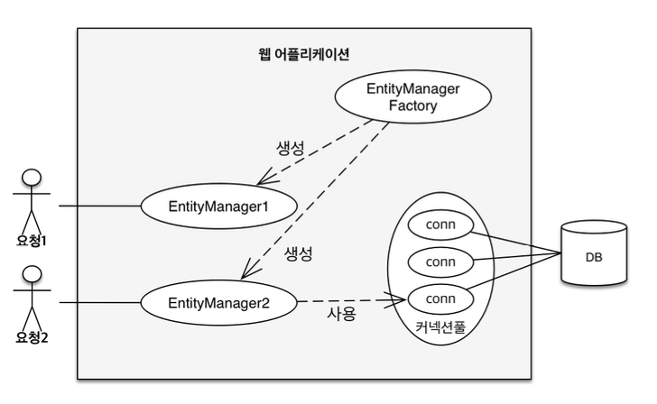
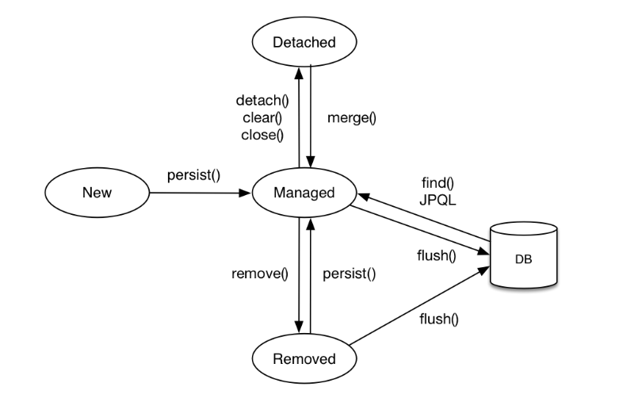
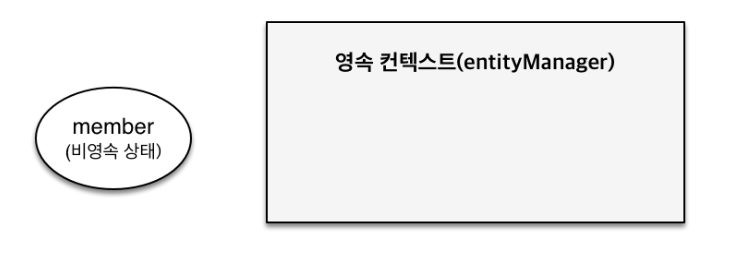
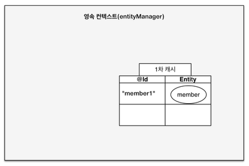
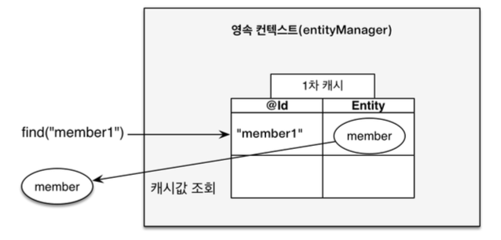
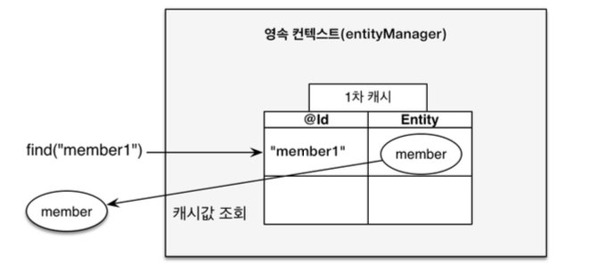
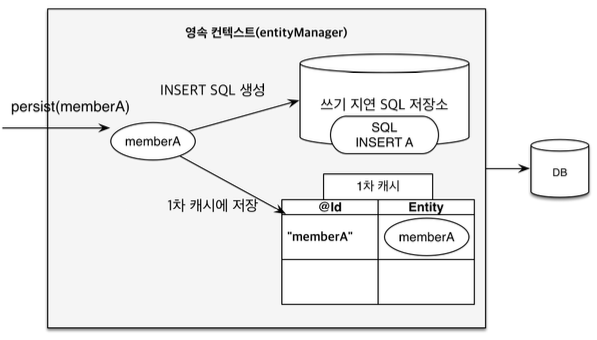
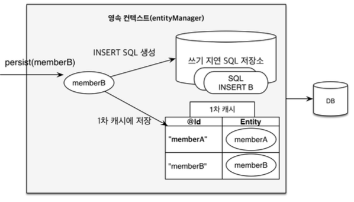
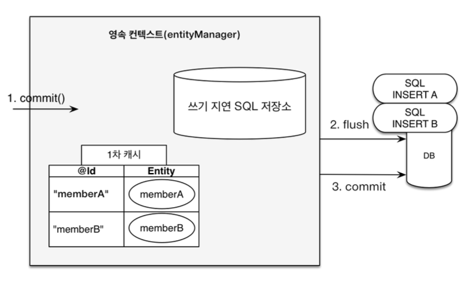
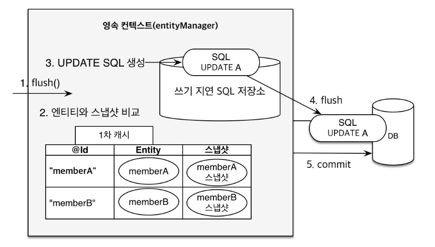

# 영속성 관리

📅 2022.07.27.~

* [엔티티 매니저 팩토리와 엔티티 매니저](#엔티티-매니저-팩토리와-엔티티-매니저)
* [1차 캐시에서 조회](#1차-캐시에서-조회)
* [엔티티 등록](#엔티티-등록)
* [엔티티 수정](#엔티티-수정(Dirty-Checking))
* [엔티티 삭제](#엔티티-삭제)


JPA가 제공하는 기능은 크게 엔티티와 테이블을 매핑하는 설계 부분과 매핑한 엔티티를 실제 사용하는 부분으로 나눌 수 있다.


## 엔티티 매니저 팩토리와 엔티티 매니저

#### persistence.xml

```xml
<?xml version="1.0" encoding="UTF-8"?>
<persistence version="2.2"
xmlns="http://xmlns.jcp.org/xml/ns/persistence" xmlns:xsi="http://www.w3.org/2001/XMLSchema-instance"
xsi:schemaLocation="http://xmlns.jcp.org/xml/ns/persistence http://xmlns.jcp.org/xml/ns/persistence/persistence_2_2.xsd">
  <persistence-unit name="hello">
    <properties>
      <property name="javax.persistence.jdbc.driver" value="org.h2.Driver"/>
      <property name="javax.persistence.jdbc.user" value="sa"/>
      <property name="javax.persistence.jdbc.password" value=""/>
      <property name="javax.persistence.jdbc.url" value="jdbc:h2:tcp://localhost/~/test"/>
      <property name="hibernate.dialect" value="org.hibernate.dialect.H2Dialect"/>
      <property name="hibernate.show_sql" value="true"/>
      <property name="hibernate.format_sql" value="true"/>
      <property name="hibernate.use_sql_comments" value="true"/>
    </properties>
  </persistence-unit>
</persistence>
```

* `Persistence.createEntityManagerFactory("hello");`: `META-INF/persistence.xml`의 정보를 바탕으로
  `EntityManagerFactory`를 생성한다.
* `EntityManager em = emf.createEntityManager();` : 를 통해서 엔티티 매니저를 생성


* 엔티티 매니저는 엔티티를 저장하고, 수정하고, 삭제하고, 조회하는 등 엔티티와 관련된 모든 일을 처리한다. 
* 데이터베이스를 하나만 사용하는 애플리케이션은 일반적으로 `EntityManagerFactory`를 하나만 생성한다.
  * 엔티티 매니저 팩토리는 엔티티 매니저를 만드는 공장, 공장을 만드는 비용이 큼
  * 반면에 공장에서 엔티티 매니저를 생성하는 비용은 거이 들지 않음


> 주의
>
> 엔티티 매니저 팩토리는 여러 스레드가 동시에 접근해도 안전하므로 서로 다른 스레드 간에 공유해도 되지만, 엔티티 매니저는
> 여러 스레드가 동시에 접근하면 동시성 문제가 발생하므로 스레드 간에 공유하면 안된다.

#### 일반적인 웹 애플리케이션
  



* `EntityManagerFactory`에서 다수의 엔티티 매니저를 생성한다.
* 그림에서 `EntityManager1`은 커넥션을 사용하지 않고있는데 엔티티 매니저는 데이터베이스 연결이 필요한 시점까지
  커넥션을 얻지 않는다.
  * 트랜잭션을 시작할 때 커넥션을 획득
  * `EntityManger2`는 커넥션을 사용중인데 보통 트랜잭션으 시작할 때 커넥션을 확득한다.
* 대부분의 JPA 구현체들은 `EntityManagerFactory`를 생성할 때 커넥션풀을 만든다.
  * J2SE 환경에서 사용하는 방법이다.

## 영속성 컨텐스트란(Persistence Context)

> 엔티티를 영구 저장하는 환경

* `em.persist(member);`
  * 해당 코드가 회원 엔티티를 저장한다고 표현하는것은 옳지 못함
  * 엔티티 매니저를 사용해서 회원 엔티티를 영속성 컨텍스트에 저장한다. 는 맥락이 정확한 표현이다.

## 엔티티의 생명주기

> 엔티티의 4가지 생명주기





#### 비영속

* `new`/`trasient`
* 영속성 컨텍스트와 전혀 관계가 없는 상태
* 엔티티 객체를 생성하여 순수한 객체 상태





```java
Member member = new Member();
member.setId(1L);
member.setName("helloA");
```


#### 영속


* `managed`
* 영속성 컨텍스트에 저장된 상태


```java
Member member = new Member();
member.setId(1L);
member.setName("helloA");

em.persist(member);
```

#### 준영속

* `detached`
* 영속성 컨텍스트에 저장되었다가 분리된 상태

#### 삭제

* `removed`
* 삭제된 상태


## 영속성 컨텍스트의 특징

#### 영속성 컨텍스트의 식별자 값
* 영속성 컨텍스트는 엔티티의 식별자 값으로 엔티티를 구분한다.
* 영속 상태는 식별자 값이 반드시 있어야 한다.

#### 영속성 컨텍스트와 데이터베이스 저장
* `JPA`는 보통 트랜잭션을 커밋하는 순산에 영속성 컨텍스트에 데이터를 반영함
  * `flush` 라고 함

#### 엔티티 관리에 대한 영속성 컨텍스트의 특징

* 1차 캐시
* 동일성 보장
* 트랜잭션을 지원하는 쓰기 지연
* 변경 감지
* 지연 로딩

### 엔티티 조회

* 영속성 컨텍스트 내부에 1차 캐시를 가지고 있다. 
  * 영속 상태의 엔티티는 모두 이곳에 저장된다.
* 영속성 컨텍스트 내부에 `Map`과 같은 자료구조가 있다
  * `@Id`로 매핑한 칼럼을 식별자로 한다.





```java
Member memebr = new Member();
member.setId("member1");
member.setUsername("회원1");

em.persist(member);
```

## 1차 캐시에서 조회


* 영속성 컨텍스트는 내부에 캐시를 가지고 있는데 이것을 `1차 캐시`라 한다. 영속 상태의 엔티티는 모두 이곳에 저장된다.
* 영속성 컨텍스트 내부에 `Map`과 같은 자료구조가 있는데 키는 `@Id`로 매핑한 식별자이고 값은 엔티티의 인스턴스다.


#### Main.java

```java
Member member = new Member();
member.setId("member1");
member.setUsername("회원1");

em.persist(member);
```





1차 캐시의 키는 식별자 값이다. 식별자 값은 데이터베이스 기본 키와 매핑되어 있다. 따라서 영속성 컨텍스트에 데이터를 저장하고 조회하는 모든 기준은
데이터베이스 기본 값이다.


`Member member = em.find(Member.class, "member1");`

`find()` 메서드를 보면 첫 번째 파라미터는 엔티티 클래스의 타입이고, 두 번째는 조회할 엔티티의 식별자이다.


`public <T> T find(Class<T> entityClass, Object primaryKey);`


`em.find()`를 호출하면 먼저 1차 캐시에서 엔티티를 찾고 만약 찾는 엔티티가 1차 캐시에 없으면 데이터베이스에서 조회한다.


### 1차 캐시에서 조회


`em.find()`를 호출하면 우선 1차 캐시에서 식별자 값으로 엔티티를 찾는다. 만약 찾는 엔티티가 있으면 데이터베이스를 조회하지 않고 메모리에 있는 
1차 캐시에서 엔티티를 조회한다.





```java
Member member = new Member();
member.setId("member1");
member.setUsername("회원1");

// 1차 캐시에 저장된다.
em.persist(member);

// 1차 캐시에서 조회
Member findMember = em.find(Member.class, "member1");
```

### 데이터베이스에서 조회

만약 `em.find()`를 호출했는데 엔티티가 1차 캐시에 없으면 엔티티 매니저는 데이터베이스를 조회해서 엔티티를 생성한다. 그리고 1차 캐시에 저장한 후에
영속 상태의 엔티티를 반환한다.

`Member findMember2 = em.find(Member.class, "member2");`


1. `em.find(Member.class, "member2");` 실행
2. `member2`가 1차 캐시에 없으므로 데이터베이스에서 조회한다.
3. 조회한 데이터 `member2` 엔티티를 생성해서 1차 캐시에 저장한다.(영속 상태)
4. 조회한 엔티티를 반환한다.

### 영속 엔티티의 동일성 보장

다음 코드를 통해 식별자가 같은 엔티티 인스턴스를 조회해서 비교하면 

```java
Member a = em.find(Member.class, "member1");
Member b = em.find(Member.class, "member1");

System.out.println(a == b);
```

여기서 `a == b`는 참이다.

em.find(Member.class, "member1")를 반복해서 호출해도 영속성 컨텍스트는 1차 캐시에 있는 같은 엔티티 인스턴스를 반환한다.
따라서 둘은 같은 인스턴스고 결과는 당연히 참이다. 따라서 영속성 컨텍스트는 성능상 이점과 엔티티의 동일성을 보장한다.


## 엔티티 등록


#### 엔티티 매니저를 사용해 엔티티를 영속성 컨텍스트에 등록

```java
EntityManager em = emf.createEntityManager();
EntityTransaction tx = em.getTransaction();
tx.begin();

em.persist(memberA);
em.persist(memberB);

tx.commit();
```


엔티티 매니저는 트랜잭션을 커밋하기 직전까지 데이터베이스에 엔티티를 저장하지 않고 내부 쿼리 저장소에 `INSERT` SQL를 모아둔다.
그리고 트랜잭션을 커밋할 때 모아둔 쿼리를 데이터베이스에 보내는데 이것을 트랙잰션을 지원하는 쓰기 지연(`Transactional write-behind`)이라 한다.





* `memberA`를 영속화했다. 영속성 컨텍스트는 1차 캐시에 회원 엔티티를 저장하면서 동시에 회원 엔티티 정보를 등록 쿼리를 만든다.
* 만들어진 등록 쿼리를 쓰기 지연 SQL 저장소에 보관한다.





* `memberB`를 영속화했다. 영속성 컨텍스트는 1차 캐시에 회원 엔티티를 저장하면서 동시에 회원 엔티티 정보를 등록 쿼리를 만든다.
* 만들어진 등록 쿼리를 쓰기 지연 SQL 저장소에 보관한다.





* 트랜잭션을 커밋한다.
* 엔티티 매니저는 우선 영속성 컨텍스트를 플러시한다.
* 등록, 수정, 삭제한 엔티티를 데이터베이스에 반영한다.

### 트랜잭션을 지원하는 쓰기 지연이 가능한 이유

```java
tx.begin();

save(memberA);
save(memberB);
save(memberC);

tx.commit();
```

#### 다음 로직에 대한 두 가지의 해석

1. 데이터를 저장하는 즉시 등록 쿼리를 데이터베이스에 보낸다. 예제에서 `save()` 메서드를 호출할 때마자 즉식 데이터베이스에
   등록 쿼리를 보낸다. 그리고 마지막에 트랜잭션을 커밋한다.
2. 데이터를 저장하면 등록 쿼리를 데이터베이스에 보내지 않고 메모리에 모아둔다. 그리고 트랜잭션을 커밋알 때 모아둔 등록 쿼리를
   데이터베이스에 보낸 후에 커밋한다.


트랜잭션 범위 안에서 실행되므로 둘의 결과는 같다. 두 로직 모두 트랜잭션을 커밋하면 함께 저장되고 롤백하면 함께 저장되니 않는다.
등록 쿼리를 그때 그때 데이터베이스에 전달해도 트랜잭션을 커밋하지 않으면 아무 소용이 없다. 어떻게든 커밋 직전에만 데이터베이스에
SQL을 전달하면 된다.


## 엔티티 수정(Dirty Checking)

JPA는 자바 컬렉션 다루듯이 데이터를 다룰 수 있게 도와준다.
우리가 어떠한 자료구조에 삽입 삭제하는 과정은 따로 호출이 필요하지만
참조된 객체의 수정을 자료구조에 반영하는 과정을 필요로 하지 않는다.
이러한 컨셉을 따라가도록 수정과정이 설계되어있다.

```java
tx.begin();
Member memberA = em.find(Member.class, "memberA");

memberA.setUsername("hi");
member.setAge(10);

tx.commit();
```

* JPA로 엔티티를 수정할 때 단순히 엔티티를 조회해서 데이터만 변경하면 된다.
* 엔티티의 변경사항을 데이터베이스에 자동으로 반영하는 기능을 변경 감지라 한다.




* JPA는 엔티티를 영속성 컨텍스트에 보관할 때, 최초 상태를 복사해서 저장해 두는데 이것을 **_스냅샷_** 이라 한다. 
* 플러시 시점에서 스냅샷과 엔티티를 비교해서 변경된 엔티티를 찾는다.

1. 트랜잭션을 커밋하면 엔티티 매니저 내부에서 먼저 플러시가 호출된다.
2. 엔티티와 스냅샷을 비교해서 변경된 엔티티를 찾는다.
3. 변경된 엔티티가 있으면 수정 쿼리를 생성해서 쓰기 지연 SQL 저장소에 보낸다.
4. 쓰기 지연 저장소의 SQL을 데이터베이스에 보낸다.
5. 데이터베이스 트랜잭션을 커밋한다.

### 실제 Update 쿼리

#### 예상되는 쿼리

```sql
UPDATE MEMBER
    SET
        NAME=?
        AGE=?
WHERE
    id=?
```

#### 실제 쿼리

```sql
UPDATE MEMBER
    SET
        NAME=?
        AGE=?
        GRADE=?
        ...
WHERE
    id=?
```
* JPA에서는 회원의 이름과 나이만 수정해도 모든 필드의 데이터를 수정 쿼리로 생성한다.
* 전송량이 증가하지만 장점이 있다.
  * 수정 쿼리가 항상 같다. 때문에 애플리케이션 로딩 시점에 수정 쿼리르 만들어 놓고 재사용할 수 있다.
  * 데이터베이스에 동일한 쿼리를 보내면 데이터베이스는 이전에 한 번 파싱된 쿼리를 재사용할 수 있다.

## 엔티티 삭제

```java
Member memberA = em.find(Member.class, "memberA");
em.remove(memberA);
```

* `em.remove()`에 삭제 대상 엔티티를 넘겨주면 엔티티를 삭제한다.
* 삭제 쿼리를 쓰기 지연 SQL 저장소에 등록한다.
* 트랜잭션을 커밋하여 플러시를 호출하면 실제 데이터베이스에 삭제 쿼리를 전달한다.
* 영속성 컨텍스트에는 `em.remove()`를 호출하는 순간 제거된다.
