- [x]  영속성 컨텍스트 1
- **JPA에서 가장 중요한 2가지**
    1. 객체와 관계형 데이터베이스 매핑 (**O**bject **R**elational **M**apping)
    2. **영속성 컨텍스트**
  

- **엔티티 매니저 팩토리와 엔티티 매니저**
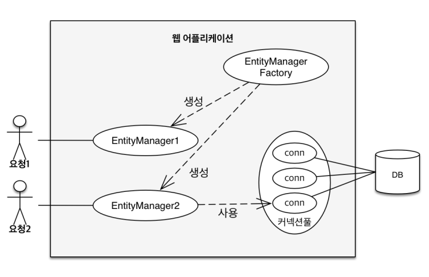      
엔티티 매니저 팩토리는 고객의 요청마다 엔티티 매니저를 생성.                      
엔티티 매니저는 DB를 사용.


- **영속성 컨텍스트란?**     
    + “엔티티를 영구 저장하는 환경”              
    + EntityManager.persist(entity); ← DB에 저장 X. 영속성 컨텍스트에 저장(영속화).


- **엔티티 매니저와 영속성 컨텍스트**            
    + 영속성 컨텍스트는 논리적인 개념(눈에 보이지 않음).    
    + 엔티티 매니저를 통해서 영속성 컨텍스트에 접근. (`J2SE` 환경에서는 1:1 관계) (`J2EE`  환경에서는 N:1 관계)


- **엔티티의 생명주기**
    - 비영속    
      + JPA랑 전혀 관계 없는 상태.
      + 그저 엔티티 객체를 생성했을 뿐인 상태.
      
    - 영속
      + 영속성 컨텍스트에 저장된 상태.
      + DB에는 저장 안됨.

    - 준영속
      + 영속성 컨텍스트에서 분리한 상태.
      + 영속 → 영속 X = 준영속

    - 삭제
      + 객체를 삭제한 상태.


```java
    package hellojpa;
    
    import javax.persistence.EntityManager;
    import javax.persistence.EntityManagerFactory;
    import javax.persistence.EntityTransaction;
    import javax.persistence.Persistence;
    
    public class jpaMain {
        public static void main(String[] args){
            EntityManagerFactory emf = Persistence.createEntityManagerFactory("hello"); //데이터 베이스 연동 되고, 대부분 다 됨
            EntityManager em = emf.createEntityManager();
            EntityTransaction tx = em.getTransaction();
            tx.begin();
            try {
                //비영속
                Member member = new Member();
                member.setId(100L);
                member.setName("회원 이름");
    
                //영속
                em.persist(member); //1차 캐시에 저장
                //객체를 영속성 컨텍스트에 저장(영속)했지만, 아직 DB에 저장되지는 않은 상태.
    						
                //삭제          
                em.detach(member); //영속성 컨텍스트에서 분리 (준영속 상태)
                em.remove(member); //객체를 삭제 (영속성 컨텍스트와 DB 모두에서 지워짐)
    
                tx.commit();
                //DB에 저장됨.
    
            } catch (Exception e) {
                tx.rollback();
            } finally {
                em.close();
            }
            emf.close();
        }
    }
```    
    
<br/>

- [x]  영속성 컨텍스트
- **영속성 컨텍스트의 이점**
    - 1차 캐시
    - 동일성(identity) 보장
    - 트랜잭션을 지원하는 쓰기 지연 (Transactional write-behind)
    - 변경감지 (Dirty Checking)
    - 지연 로딩 (Lazy Loading)


- **1차 캐시**
    + [1차 캐시 ≒ 영속성 컨텍스트] 라고 봐도 무방.
    + 동일한 트랜잭션 안에서 한번 조회하면 DB에 쿼리가 날라가지 않음.

plus) 10명의 고객이 동시에 접근하면 10개의 1차 캐시가 만들어지는 셈으로 성능상의 개선은 별로 없지만,  메커니즘을 통해 얻을 수 있는 이점이 있기에 사용.


- 조회
```java
em.persist(member);
//1차 캐시에서 조회
Member findMember1 = em.find(Member.class, "member1");
//데이터베이스에서 조회
Member findMember2 = em.find(Member.class, "member2");
```

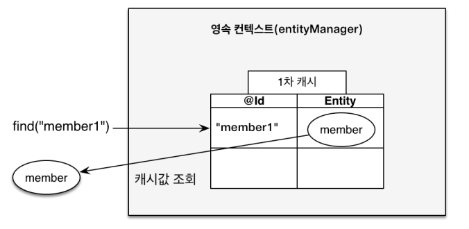
→ 1차 캐시에서 조회

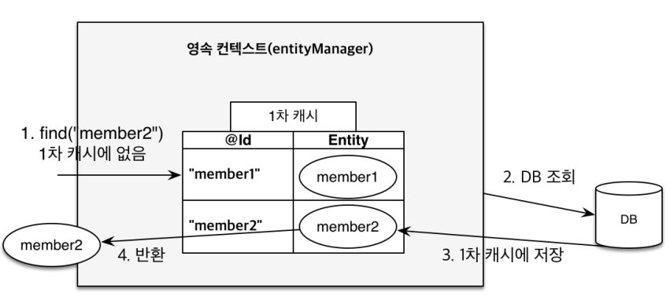
→ 데이터베이스에서 조회

<br/>
<br/>

- 영속 엔티티의 **동일성 보장 (identity)**

```java
Member findMember1 = em.find(Member.class, 100L);
Member findMember2 = em.find(Member.class, 100L);

System.out.println("result = " + (findMember1 == findMember2));
```

> result = true    
             
<br/>

- **엔티티 등록** - 트랜젝션을 지원하는 **쓰기 지연 (transactional write-behind)**

```java
package hellojpa;

import javax.persistence.EntityManager;
import javax.persistence.EntityManagerFactory;
import javax.persistence.EntityTransaction;
import javax.persistence.Persistence;

public class jpaMain {
    public static void main(String[] args){
        EntityManagerFactory emf = Persistence.createEntityManagerFactory("hello"); //데이터 베이스 연동 되고, 대부분 다 됨
        EntityManager em = emf.createEntityManager();
        EntityTransaction tx = em.getTransaction();
				//트랜잭션 시작
        tx.begin();

        try {
            Member member1 = new Member(110L, "A");
            Member member2 = new Member(111L, "B");
            
            //쓰기지연 SQL 저장소에 쌓이는 중입니다.	          
            em.persist(member1);
            em.persist(member2);
											
            System.out.println("아직 데이터베이스에 보내지 않은 상태입니다.");
            
            tx.commit();  //커밋하는 순간 DB에 INSERT SQL을 보낸다.
						//트랜잭션 커밋
        } catch (Exception e) {
            tx.rollback();
        } finally {
            em.close();
        }
        emf.close();
    }
}
```

- em.persist(member1);    
  em.persist(member2);
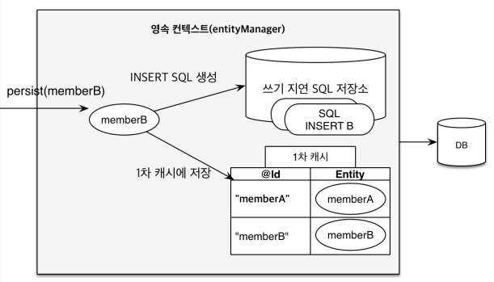

- tx.commit();
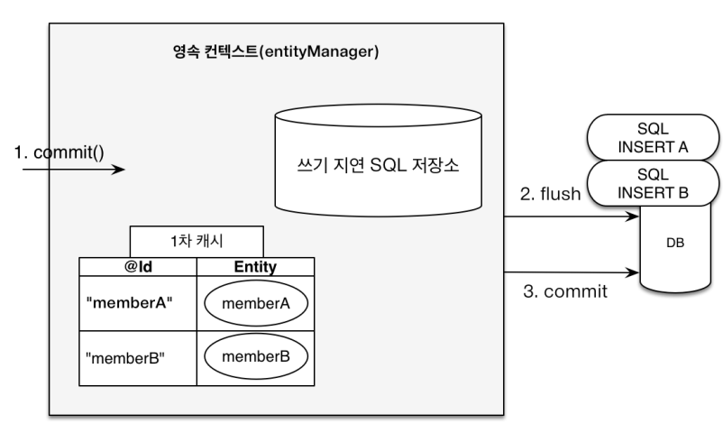

<br/>

- **엔티티 수정** - **변경 감지 (Dirty Checking)**    
→ ID : 110 를 수정해보자.         
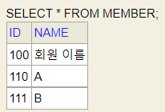   =>
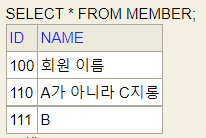

```java
package hellojpa;

import javax.persistence.EntityManager;
import javax.persistence.EntityManagerFactory;
import javax.persistence.EntityTransaction;
import javax.persistence.Persistence;

public class jpaMain {
    public static void main(String[] args){
        EntityManagerFactory emf = Persistence.createEntityManagerFactory("hello"); //데이터 베이스 연동 되고, 대부분 다 됨
        EntityManager em = emf.createEntityManager();
        EntityTransaction tx = em.getTransaction();
        //트랜잭션 시작
        tx.begin();

        try {
            // 영속 엔티티 조회
            Member member = em.find(Member.class, 110L);
            // 영속 엔티티 데이터 수정
            member.setName("A가 아니라 C지롱");
            tx.commit();
            //트랜잭션 커밋
        } catch (Exception e) {
            tx.rollback();
        } finally {
            em.close();
        }
        emf.close();
    }
}
```


>💡 Q. em.update(member); ← 이런 코드가 필요하지 않을까?                  
   A. 필요하지 않음. JPA는 값을 바꾸면 커밋하는 순간 반영함. 별다른 코드 없어도 됨! 편리하당!

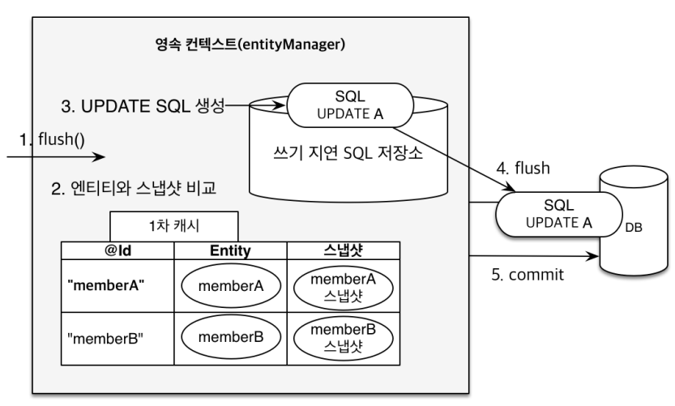

1. 데이터 트랜잭션 커밋 = **flush()**
2. **엔티티와 스냅샷 비교**
    - 스냅샷? : 최초로 값을 읽어 온 (1차 캐시에 데이터가 들어온) 시점의 상태.
3. if. 엔티티와 스냅샷이 일치하지 않으면, **UPDATE SQL 생성**
4. 이후는, 쓰기 지연이 포함된 **엔티티 등록** 과정 진행

<br/>

- **엔티티 삭제**        
  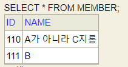   => 
  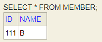

```java
package hellojpa;

import javax.persistence.EntityManager;
import javax.persistence.EntityManagerFactory;
import javax.persistence.EntityTransaction;
import javax.persistence.Persistence;

public class jpaMain {
    public static void main(String[] args){
        EntityManagerFactory emf = Persistence.createEntityManagerFactory("hello"); //데이터 베이스 연동 되고, 대부분 다 됨
        EntityManager em = emf.createEntityManager();
        EntityTransaction tx = em.getTransaction();
        tx.begin();
        try {
            //삭제 대상 엔티티 조회
            Member member1 = em.find(Member.class, 110L);
            //엔티티 삭제
            em.remove(member1);

            tx.commit();
            //삭제됨

        } catch (Exception e) {
            tx.rollback();
        } finally {
            em.close();
        }
        emf.close();
    }
} 
```
<br/>

- [x]  플러시
- 플러시(flush)?    
: 영속성 컨텍스트의 변경 내용을 데이터베이스에 반영.    
! 영속성 컨텍스트를 비우는 것이 아님!    
! 영속성 컨텍스트의 변경내용을 데이터베이스에 동기화 하는 과정!    
! 트랜잭션이라는 작업 단위가 중요 → 커밋 직전에만 동기화 하면 된다!

> em.setFlushMode(FlushModeType.COMMIT);

*FlushModeType.AUTO // 커밋이나 퀴리를 실행할 때 플러시(기본값! 웬만하면 변경 x)
*FlushModeType.COMMIT // 커밋할 때만 플러시

- 플러시 발생
    - 변경 감지
    - 수정된 엔티티 쓰기 지연 SQL 저장소에 등록
    - 쓰기지연 SQL 저장소의 쿼리를 데이터베이스에 전송 (등록, 수정, 삭제 쿼리)

- 영속성 컨텍스트 플러시 방법

  + [직접 호출]

    - em.flush()

        ```java
        Member member = new Member(200L, "이름");
                    em.persist(member);
                    em.flush(); //DB에 반영됨
                    tx.commit();
    
  + [플러시 자동 호출]
    - 트랜잭션 커밋
    - JPQL 퀴리 실행
    
<br/>

- [x]  준영속 상태   
: 영속 상태의 엔티티가 영속성 컨텍스트에서 분리.   
⇒ 영속성 컨텍스트가 제공하는 기능을 사용하지 못함


- 준영속 상태로 만드는 방법
    - em.detach(entity) ← 특정 엔티티만 준영속 상태로 전환
    - em.clear() ← 영속성 컨텍스트를 완전히 초기화 (= 1차 캐시 초기화)

        ```java
        Member member = em.find(Member.class, 111L);
        member.setName("BB");
        
        em.clear();
        
        System.out.println("===영속성 컨텍스트 초기화===");
                    
        Member member2 = em.find(Member.class, 111L);
  
    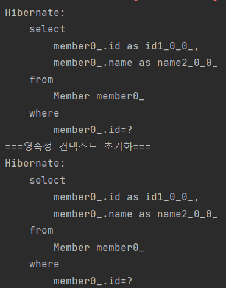
    
    - em.close() ← 영속성 컨텍스트를 종료