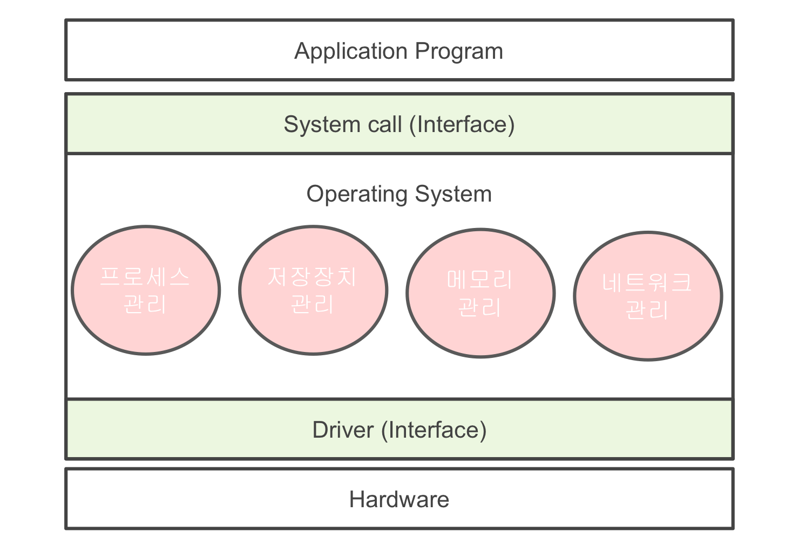
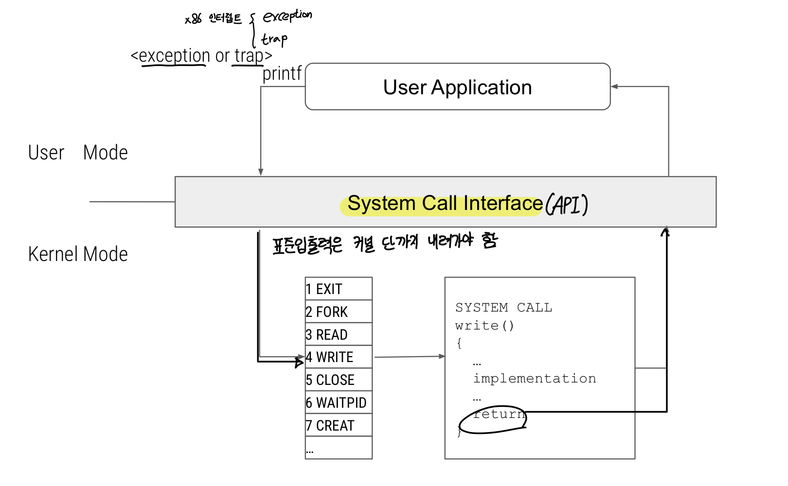

# 운영체제와 컴퓨터

## 운영체제의 역할과 구조

#### 운영체제의 역할

1. 프로세스 관리: CPU 소유권을 어떤 프로세스에 할당할지 프로셋의 생성과 삭제 자원 할등 및 반환을 관리한다.
   * 프로세스, 스레드 
   * 스케줄링 
   * 동기화 
   * IPC 통신

2. 메모리 관리: 한정된 메모리를 어떤 프로세스에 얼안큼 할당해야 하는지 관리한다. 
   * 메모리 관리
   * 가상 메모리
   * 파일 시스템

3. 디스크 파일 관리: 디스크 파일을 어떠한 방법으로 보관할지 관리한다.
    * 파일 시스템

4. I/O 디바이스 관리: I/O 디바이스들인 마우스, 키보드와 컴퓨터 간에 데이터를 주고받는 것을 관리한다.
   * 인터럽트

#### 운영체제의 구조





### 시스템콜





* 컴퓨팅 자원을 검증되지 않은 사용자가 직접 제어하는 것은 위험이 따른다.
  * 직접적으로 컴퓨팅 자원을 사용하는 작업은 안전하게 작성된 `Kernel Mode`의 시스템콜을 통해서만
    가능하도록 한다.
* `fork()`, `exec()`, `wait()`와 같은 것들은 Process 생성과 제어를 위한 시스템콜이다.
* 컴퓨터에서 일어나는 모든 작업을 입출력의 형태로 추상화 한다면 마우스, 키보드, 표준입출력을 모두 파일 입출력으로
  인터페이스를 간소화시킬 수 있기 때문에 시스템의 복잡성을 해소해줄 수 있다.

#### `main.c`

```c
#include <stdio.h>
#include <stdlib.h>

int main(){
   printf("Hello World");
   exit(0);
}
```

#### `a.out`

```s
section .data
msg db "Hello, World", 0x0A
section .text
global _start

_start //엔트리 포인트 
mov eax, 4 // 커널에서 4번의 시스템콜(WRITE)을 실행
mov ebx, 1 
mov ecx, msg 
mov edx, 12 
int 0x80

mov eax, 1 // 커널에서 1번의 시스템콜(EXIT)을 실행
mov ebx, 0 
int 0x80
```

## 컴퓨터의 요소

### CPU

* 산술논리연산장치, 제어장치, 레지스터로 구성되어 있다.
* 레지스터
  * `PC` - 다음 명령어 위치를 저장
  * `IR` - 현재 명령어를 저장
  * `MAR` - 메모리 관리자가 접근해야 할 메모리 주소를 저장
  * `MBR` 
  * `AR`